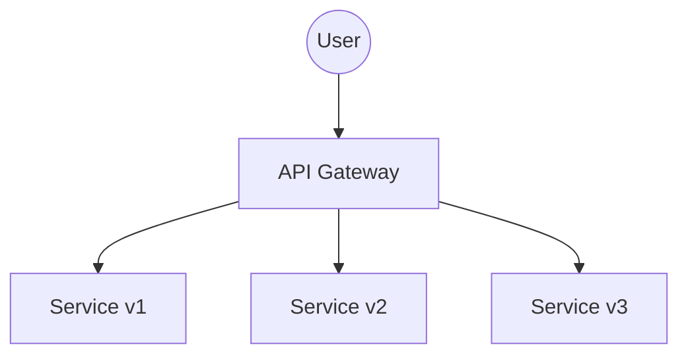

# Implementing API versioning

The overall implementation architecture is as follows.



All three services implement two URIs: `/hello` and `/hi`, which just print the URI with a version number.

For users, to call the corresponding service, they just put a prefix in front of the URI, e.g. `curl http://localhost/v2/hello` would print out

> hello v2

In addition, calling a non-white-listed (v1, v2 and v3) version will fallback to v1, e.g., `curl http://localhost/v4/hello` will print

> hello v1

The core of this experiment is nginx on the gateway.

```nginx
http {
    server {
        listen 80;

        location ^~ /v1/ {
            rewrite /v1/(.*) /$1 break;
            proxy_pass http://web_v1;
        }

        location ^~ /v2/ {
            rewrite /v2/(.*) /$1 break;
            proxy_pass http://web_v2;
        }

        location ^~ /v3/ {
            rewrite /v3/(.*) /$1 break;
            proxy_pass http://web_v3;
        }

        location ~ /v(\d+)/ {
            rewrite /v(\d+)/(.*) /$2 break;
            proxy_pass http://web_v1;
        }

    }
}
```

If the location matches the previous 3 rules, then rewrite the original URI, remove the prefix and redirect to the corresponding service, if it doesn't match the previous rules but matches the version specification (v plus integer), then redirect to the v1 service anyway.

By using nginx regex, we can make the version match the corresponding service and implement the extra fallback mechanism.
